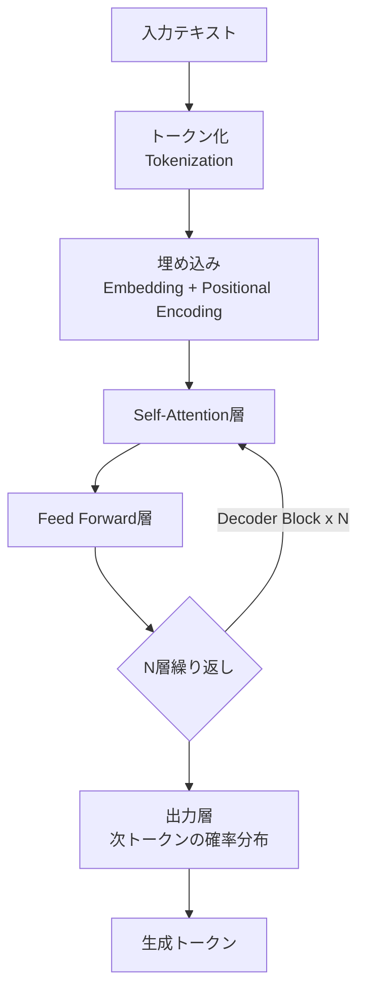

# 01. AI・LLMの基礎知識

生成AI・大規模言語モデル(LLM)を理解する上で欠かせない基礎概念をまとめる。

---

## 1. LLM（大規模言語モデル）の仕組み

### 1.1 Transformerアーキテクチャ

現代のLLMはほぼ全て**Transformer**アーキテクチャ（2017年 "Attention Is All You Need"）をベースにしている。中核となるのは**Self-Attention機構**であり、文中の各単語が他のどの単語に「注意」を向けるべきかを学習する仕組みである。



**主要概念:**

| 用語 | 説明 |
|---|---|
| **Self-Attention** | 各トークンが文脈内の他のトークンとの関連度を計算する仕組み |
| **Multi-Head Attention** | Attentionを複数の「頭」で並列に計算し、異なる観点の関係性を捉える |
| **Positional Encoding** | 単語の順序情報をモデルに与えるための位置情報埋め込み |
| **Decoder-only** | GPT系・Claude系など多くのLLMが採用するアーキテクチャ（次トークン予測に特化） |

### 1.2 トークン（Token）

LLMは文章を**トークン**という単位で処理する。1トークンは単語そのものとは限らず、サブワード（単語の一部）単位で分割されることが多い。

- 英語: 概ね 1トークン ≈ 4文字程度
- 日本語: 1文字が複数トークンに分割されることもあり、英語よりトークン効率が悪い傾向がある

### 1.3 コンテキストウィンドウ（Context Window）

モデルが一度に処理できるトークン数の上限。これを超えた入力は切り捨てられるか、エラーとなる。

| モデル | コンテキストウィンドウ（目安） |
|---|---|
| GPT-4o | 128,000 トークン |
| Claude 3.5 Sonnet | 200,000 トークン |
| Gemini 1.5 Pro | 1,000,000 トークン以上 |

> ⚠️ コンテキストウィンドウが大きいほど長文を扱えるが、**推論コスト・レイテンシも増加する**点に注意。

---

## 2. 主要モデルの比較

| モデル | 提供元 | 得意分野 | 特徴 | 適したユースケース |
|---|---|---|---|---|
| **GPT-4o** | OpenAI | マルチモーダル（音声・画像） | 応答速度が速く汎用性が高い | チャットボット、リアルタイム対話 |
| **Claude 3.5 Sonnet** | Anthropic | 長文読解・コーディング・安全性 | 長いコンテキストと高精度な指示追従 | コード生成、文書要約、エージェント |
| **Gemini 1.5 Pro** | Google | 超長文コンテキスト・マルチモーダル | 動画・音声も含む幅広い入力に対応 | 大規模ドキュメント解析、動画理解 |

**使い分けの指針:**

- コーディング支援や複雑な指示追従 → **Claude系**
- リアルタイム性・音声対話重視 → **GPT-4o**
- 超長文（書籍1冊分など）の一括処理 → **Gemini 1.5 Pro**

---

## 3. Pythonによるトークン数カウント

APIコール前にトークン数を見積もることで、コスト管理やコンテキストウィンドウ超過を防止できる。

```python
import tiktoken

def count_tokens(text: str, model: str = "gpt-4o") -> int:
    """
    指定したモデルのエンコーディングを使用してテキストのトークン数を計算する。

    Args:
        text: トークン数を計測する対象の文字列
        model: 使用するモデル名（エンコーディング取得に使用）

    Returns:
        トークン数（int）
    """
    try:
        encoding = tiktoken.encoding_for_model(model)
    except KeyError:
        # モデルが未登録の場合は汎用エンコーディングにフォールバック
        encoding = tiktoken.get_encoding("cl100k_base")

    tokens = encoding.encode(text)
    return len(tokens)


if __name__ == "__main__":
    sample_text = "生成AIは自然言語処理の分野を大きく変革した。"
    token_count = count_tokens(sample_text)
    print(f"テキスト: {sample_text}")
    print(f"トークン数: {token_count}")
```

**実行結果イメージ:**
```
テキスト: 生成AIは自然言語処理の分野を大きく変革した。
トークン数: 24
```

> 💡 日本語は英語よりトークン消費が多くなりがちなので、コスト試算の際は実測することを推奨する。

---

## 参考リンク
- [OpenAI Tokenizer](https://platform.openai.com/tokenizer)
- [Anthropic Claude Docs](https://docs.claude.com)
- Attention Is All You Need (Vaswani et al., 2017)
