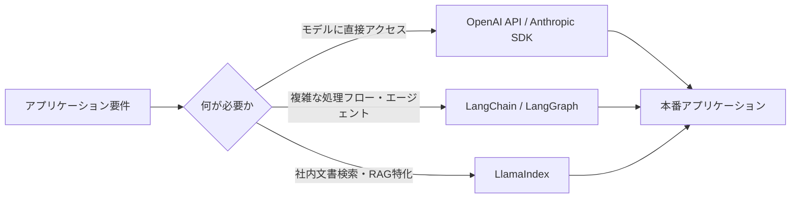

# 02. アプリケーション導入時の実践ライブラリ

LLMを実際のアプリケーションに組み込む際に使用される主要なPythonライブラリを整理する。

---

## 1. 主要ライブラリの概要



### 1.1 OpenAI API（および各社公式SDK）

モデル提供元が直接公開するAPI。抽象化レイヤーが薄く、**モデルの生の機能に最も近い形でアクセス**できる。

### 1.2 LangChain

LLMアプリケーション開発のための**汎用フレームワーク**。プロンプト管理、チェーン（処理の連結）、エージェント、メモリ機能などを提供する。近年は複雑なワークフロー構築のため**LangGraph**（状態機械ベースの拡張）が推奨されることが多い。

### 1.3 LlamaIndex

**RAG（検索拡張生成）に特化**したデータフレームワーク。ドキュメントの読み込み・インデックス化・検索に強みを持つ。

---

## 2. ライブラリ比較表

| ライブラリ | メリット | デメリット | 適した用途 |
|---|---|---|---|
| **OpenAI API（公式SDK）** | シンプル・軽量・レイテンシが低い・ドキュメントが豊富 | 複雑なワークフロー構築には自前実装が必要 | シンプルなチャット機能、プロトタイピング |
| **LangChain** | 豊富な統合（DB, 検索, ツール）、エージェント構築が容易 | 抽象化が多くデバッグしづらい場合がある、バージョン変更が頻繁 | マルチステップの業務フロー、エージェント型アプリ |
| **LlamaIndex** | ドキュメント検索・インデックス構築に特化し高速 | 汎用的なエージェント構築にはLangChainほど柔軟でない | 社内ナレッジベース検索、RAGシステム |

> 💡 実務では「RAGの検索部分はLlamaIndex、全体のフロー制御はLangGraph」のように**併用**するケースも多い。

---

## 3. Python実装例：OpenAI APIによるChat Completion

```python
from openai import OpenAI

# クライアントの初期化（環境変数 OPENAI_API_KEY を使用）
client = OpenAI()

def get_chat_response(user_message: str, system_prompt: str = "あなたは親切なアシスタントです。") -> str:
    """
    OpenAI Chat Completions APIを呼び出し、応答テキストを返す。

    Args:
        user_message: ユーザーからの入力メッセージ
        system_prompt: モデルの振る舞いを指定するシステムプロンプト

    Returns:
        モデルの応答テキスト
    """
    response = client.chat.completions.create(
        model="gpt-4o",
        messages=[
            {"role": "system", "content": system_prompt},
            {"role": "user", "content": user_message},
        ],
        temperature=0.7,
        max_tokens=500,
    )
    return response.choices[0].message.content


if __name__ == "__main__":
    answer = get_chat_response("RAGとは何か、3行で説明してください。")
    print(answer)
```

---

## 4. Python実装例：LangChainによる簡易チェーン

```python
from langchain_openai import ChatOpenAI
from langchain_core.prompts import ChatPromptTemplate
from langchain_core.output_parsers import StrOutputParser

# モデルとプロンプトテンプレートの定義
llm = ChatOpenAI(model="gpt-4o", temperature=0.3)

prompt = ChatPromptTemplate.from_messages([
    ("system", "あなたは技術文書を分かりやすく要約する専門家です。"),
    ("user", "以下の文章を3行で要約してください:\n\n{document}"),
])

# チェーンの構築（プロンプト → LLM → 出力パーサー）
chain = prompt | llm | StrOutputParser()

if __name__ == "__main__":
    result = chain.invoke({"document": "ここに長い技術文書を挿入..."})
    print(result)
```

---

## 参考リンク
- [OpenAI Python SDK](https://github.com/openai/openai-python)
- [LangChain公式ドキュメント](https://python.langchain.com/)
- [LlamaIndex公式ドキュメント](https://docs.llamaindex.ai/)
