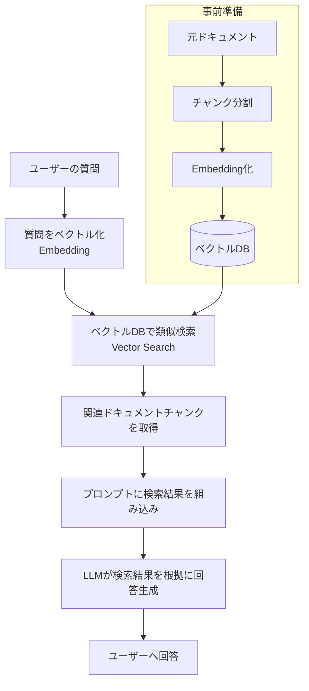
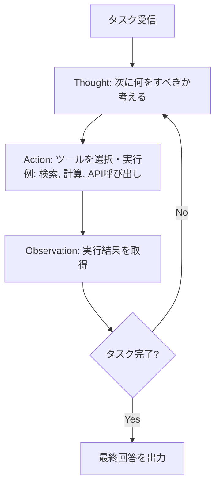

# 03. 設計思想・先進的なアーキテクチャ

LLMを活用したシステムを設計する上で重要な思想・パターンをまとめる。

---

## 1. プロンプトエンジニアリングの基本原則

### 1.1 Zero-shot / Few-shot プロンプティング

| 手法 | 説明 | 使い所 |
|---|---|---|
| **Zero-shot** | 例を与えず、指示のみでタスクを実行させる | シンプルなタスク、モデルが既に十分な知識を持つ場合 |
| **Few-shot** | 入出力の例をいくつか提示してからタスクを実行させる | 出力フォーマットを厳密に制御したい場合 |
| **CoT（Chain-of-Thought）** | 「段階的に考えて」と指示し、思考過程を明示的に出力させる | 複雑な推論・計算タスク |

```python
from openai import OpenAI

client = OpenAI()

# Few-shotプロンプトの例：感情分類タスク
few_shot_prompt = """
以下はレビュー文とその感情分類の例です。

レビュー: "配送が早くて梱包も丁寧でした。"
感情: ポジティブ

レビュー: "説明と違う商品が届いた。"
感情: ネガティブ

レビュー: "普通の商品でした。特に良くも悪くもない。"
感情: 中立

レビュー: "{target_review}"
感情:
"""

def classify_sentiment(review: str) -> str:
    """Few-shotプロンプトを用いてレビューの感情分類を行う。"""
    response = client.chat.completions.create(
        model="gpt-4o",
        messages=[{"role": "user", "content": few_shot_prompt.format(target_review=review)}],
        temperature=0,  # 分類タスクなので決定的な出力にする
    )
    return response.choices[0].message.content.strip()


# CoT（Chain-of-Thought）プロンプトの例
cot_prompt = "次の問題を段階的に考えてから、最終的な答えを出してください。\n\n{question}"
```

> 💡 分類・抽出などの**決定的なタスク**では `temperature=0` を、創造的な文章生成では `temperature=0.7〜1.0` を使い分けるのが基本。

---

## 2. RAG（検索拡張生成）の設計

### 2.1 RAGとは

LLM自体の知識だけに頼らず、**外部データベースやドキュメントから関連情報を検索し、それをプロンプトに組み込んでから回答を生成**する手法。ハルシネーション抑制・最新情報への対応・社内ナレッジの活用に有効。



### 2.2 RAGの主要コンポーネント

| コンポーネント | 役割 | 代表的な技術 |
|---|---|---|
| **チャンキング** | 長文を検索しやすい単位に分割 | 固定長分割、意味的分割（Semantic Chunking） |
| **Embeddingモデル** | テキストをベクトル化 | OpenAI text-embedding-3, Cohere Embed |
| **ベクトルDB** | ベクトルを保存し類似検索を行う | Chroma, Pinecone, FAISS, Qdrant |
| **リランキング** | 検索結果の精度をさらに向上 | Cohere Rerank, Cross-Encoder |

```python
# 簡易RAGの実装イメージ（LlamaIndex使用）
from llama_index.core import VectorStoreIndex, SimpleDirectoryReader

def build_rag_index(documents_dir: str) -> VectorStoreIndex:
    """指定ディレクトリのドキュメントを読み込みベクトルインデックスを構築する。"""
    documents = SimpleDirectoryReader(documents_dir).load_data()
    index = VectorStoreIndex.from_documents(documents)
    return index


def query_rag(index: VectorStoreIndex, question: str) -> str:
    """構築済みインデックスに対して質問応答を行う。"""
    query_engine = index.as_query_engine(similarity_top_k=3)
    response = query_engine.query(question)
    return str(response)
```

---

## 3. エージェント型AI（Agentic AI）

### 3.1 ReActパターン

**ReAct（Reasoning + Acting）**は、モデルが「思考（Reasoning）」と「行動（Acting、例：ツール呼び出し）」を交互に繰り返しながらタスクを遂行するパターン。



### 3.2 LangGraphによるエージェント構築

**LangGraph**は状態を持つグラフ構造でエージェントのフローを定義するフレームワークであり、条件分岐やループ（上記のThought→Action→Observationサイクル）を明示的にコントロールできる。

```python
from langgraph.graph import StateGraph, END
from typing import TypedDict

class AgentState(TypedDict):
    """エージェントが保持する状態を定義"""
    input: str
    thought: str
    action_result: str
    final_answer: str

def reasoning_node(state: AgentState) -> AgentState:
    """思考ステップ：次のアクションを決定する"""
    # ここでLLMを呼び出し、次の行動を決定するロジックを実装
    state["thought"] = "検索ツールを使うべきだと判断"
    return state

def action_node(state: AgentState) -> AgentState:
    """行動ステップ：ツールを実行する"""
    # 実際のツール呼び出し（検索API等）をここに実装
    state["action_result"] = "検索結果のダミーデータ"
    return state

# グラフの構築
workflow = StateGraph(AgentState)
workflow.add_node("reasoning", reasoning_node)
workflow.add_node("action", action_node)
workflow.set_entry_point("reasoning")
workflow.add_edge("reasoning", "action")
workflow.add_edge("action", END)

app = workflow.compile()
```

### 3.3 今後の展望

- **マルチエージェント協調**：複数の専門エージェントが役割分担して1つのタスクを解決する構成が普及しつつある
- **ツール利用の高度化**：MCP（Model Context Protocol）のような標準規格により、外部サービスとの連携が容易になっている
- **自律性と制御のバランス**：エージェントの自律的な判断力向上と同時に、安全性・検証可能性の担保が今後の重要課題

---

## 参考リンク
- ReAct: Synergizing Reasoning and Acting in Language Models (Yao et al., 2022)
- [LangGraph公式ドキュメント](https://langchain-ai.github.io/langgraph/)
