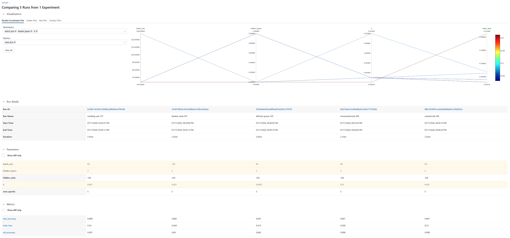

# 07. MLOps / LLMOps

本章は「モデルのデプロイ・運用・継続的改善」を扱う章として設けています。現時点では、AIエンジニア学習ロードマップ フェーズ2にあたる**実験管理（Experiment Tracking）**の内容のみを記載しています。デプロイ・継続的改善に関する内容は今後追記予定です。

実践プロジェクトの成果物は [mlflow-experiment-tracking](https://github.com/ktwpjmmxx/mlflow-experiment-tracking) にあります。

---

## 実験管理（Experiment Tracking）

---

## 1. なぜ実験管理が必要か

機械学習モデルの開発は、ハイパーパラメータや前処理を変えながら何度も試行錯誤するプロセスである。しかしprint文とメモだけで管理していると、以下のような問題が起きる。

- 「この精度が出たときのlrはいくつだったか」が分からなくなる
- 複数の設定を横断して比較しづらい
- 再現性（同じ結果を再現できるか）が担保できない
- 学習済みモデルの成果物（重み・シリアライズ済みファイル）がどこにあるか分からなくなる

これらを解決するのが**実験管理（Experiment Tracking）ツール**であり、代表的なものにMLflowとWeights & Biases（W&B）がある。今回はMLflowを使って、以下の3要素を記録するワークフローを実践した。

| 記録対象 | MLflowのAPI | 具体例 |
|---|---|---|
| パラメータ（Params） | `mlflow.log_param()` | lr, batch_size, hidden_layers |
| 指標（Metrics） | `mlflow.log_metric()` | train_loss, val_accuracy（step指定で推移をグラフ化） |
| 成果物（Artifacts） | `mlflow.pytorch.log_model()` | 学習済みモデルファイル |

## 2. 題材とプロジェクト方針

過去のプロジェクト（Tech-Comply-AI等）とは切り離し、**Fashion-MNIST画像分類 + シンプルなCNN**という、まっさらな題材で実験管理そのものの型を身につける方針にした。過去プロジェクトはFine-Tuning実験の反復（v3〜v12+等）で経緯が複雑化しており、そこに新しい学習テーマを乗せるとノイズになると判断したため。

モデル構造（`SimpleCNN`）は、畳み込み層を固定し、全結合層の隠れ層数・ユニット数だけを可変にする設計にした。これにより「実験のたびに何を変えたか」が明確になり、比較がしやすくなる。

```python
class SimpleCNN(nn.Module):
    def __init__(self, hidden_layers: int = 2, hidden_units: int = 128):
        super().__init__()
        self.conv = nn.Sequential(...)  # 畳み込みは固定
        fc_layers = [nn.Flatten(), nn.Linear(32 * 7 * 7, hidden_units), nn.ReLU()]
        for _ in range(hidden_layers - 1):
            fc_layers += [nn.Linear(hidden_units, hidden_units), nn.ReLU()]
        fc_layers.append(nn.Linear(hidden_units, 10))
        self.fc = nn.Sequential(*fc_layers)
```

## 3. つまずいた点：MLflow 3.x系のシリアライズ形式変更

### 発生した事象

`mlflow.pytorch.log_model(model, "model")`を実行した際、以下のエラーで停止した。

```
mlflow.exceptions.MlflowException: If `serialization_format` is set to 'pt2', then input_example is required.
It must be a numpy array or torch tensor, or a tuple/list of numpy arrays or torch tensors.
This is because 'pt2' is a traced-graph format: PyTorch traces the model graph by virtually
executing model.forward with the provided example input.
```

### 調査プロセス

過去のプロジェクト（Gemini APIモデル廃止のトラブル）で得た教訓「プラウジブルな仮説に飛びつく前に、外部サービスのライフサイクル情報を確認する」を踏まえ、まずMLflow公式ドキュメント・リリースノートを確認した。その結果、**近年のMLflowリリースで`mlflow.pytorch.log_model`のデフォルトの`serialization_format`が`pickle`から`'pt2'`（`torch.export`ベースのグラフトレース形式）に変更されていた**ことが判明した。

`input_example`を渡した1次対応後も、以下の別エラーが発生した。

```
torch.fx.experimental.symbolic_shapes.ConstraintViolationError: Constraints violated (dynamic_dim)!
- Not all values of dynamic_dim = L['x'].size()[0] in the specified range are valid
  because dynamic_dim was inferred to be a constant (1).
```

これは、`pt2`形式が`torch.export`によってモデルをグラフとしてトレースする際、バッチ次元（サンプル数）を動的な次元として扱おうとするが、`input_example`としてバッチサイズ1のテンソルしか渡していなかったため、dynamo側が「バッチ次元は定数1である」と推論してしまい、制約違反になった、という仕組みである。

### 対応

モデルの本番デプロイ・移植性を重視しない今回の学習用途では、`serialization_format="pickle"`を明示指定し、`pt2`トレースの経路自体をバイパスするのが実用的と判断した。

```python
mlflow.pytorch.log_model(
    model,
    name="model",              # artifact_pathは非推奨。nameを使う
    input_example=example_input,
    serialization_format="pickle",
)
```

これにより従来通り`torch.save`ベースのシリアライズになり、警告（pickle形式のセキュリティ上の注意喚起）は出るが、正常に保存できるようになった。

### この経験からの一般化できる学び

- **ライブラリのデフォルト挙動は将来変わりうる。** 動いていたコードが急にエラーになったとき、まず疑うべきは「自分のコードのバグ」だけでなく「依存ライブラリの仕様変更」であるという視点を持つこと。
- エラーメッセージを鵜呑みにして表面的な対応（`input_example`を渡すだけ）をすると、別の深い層のエラー（`ConstraintViolationError`）に当たることがある。エラーの根本原因（今回であれば「デフォルトのシリアライズ形式が変わった」という一段上の事実）まで遡って理解することが重要。

## 4. ハイパーパラメータ比較実験

学習率（lr）・バッチサイズ（batch_size）・隠れ層数（hidden_layers）について、ベースラインから1つの変数のみを変更する one-factor-at-a-time 方式で5パターンを実行し比較した。

| Run名 | lr | batch_size | hidden_layers | test_accuracy | train_loss | val_accuracy |
|---|---|---|---|---|---|---|
| vaunted-elk-340（ベースライン） | 0.001 | 64 | 2 | 0.897 | 0.230 | 0.908 |
| rumbling-auk-741 | 0.001 | 64 | 3 | 0.898 | 0.240 | 0.907 |
| monumental-bat-905 | 0.01 | 64 | 2 | 0.891 | 0.269 | 0.898 |
| fearless-mink-597 | 0.001 | 128 | 2 | 0.885 | 0.264 | 0.890 |
| efficient-goose-339 | 0.0001 | 64 | 2 | 0.847 | 0.413 | 0.862 |



MLflow UIのParallel Coordinates Plotでは、複数のパラメータ・指標を横並びの軸にして各runを1本の折れ線として可視化できる。今回のプロットでは`lr`の軸を見ると、`lr=0.0001`のrunだけが明らかに外れた位置（train_lossが高い＝グラフ上で赤色）にあり、視覚的に「学習率が低すぎると学習不足になる」ことが一目で分かる。

### 考察

- **学習率（lr）が最も感度の高いハイパーパラメータだった。** `lr=0.0001`（低すぎ）は5エポックでは収束不足、`lr=0.01`（高すぎ）は不安定さによる悪化が見られた。ベースラインの`lr=0.001`が最適。
- `hidden_layers=3`はベースラインよりごくわずかに良い結果（0.898 vs 0.897）だったが、次節で述べる再現性上の制約により、誤差範囲内とみなすのが妥当。
- `batch_size`を128に増やすと精度がやや低下。同一エポック数内でのパラメータ更新回数が減ったことが一因と考えられる。

## 5. 再現性の限界（今後の課題）

`get_dataloaders`内で`random_split`を使ってtrain/valを分割しているが、乱数シードを固定していないため、実行のたびに分割結果が変わる。つまり今回の5本の比較には「ハイパーパラメータの違い」だけでなく「val分割の違い」というノイズが混入している。特に`hidden_layers=3`とベースラインの差（0.898 vs 0.897）のような小さな差は、このノイズの範囲内である可能性が高い。

今後、より厳密な比較を行う場合は`torch.manual_seed(42)`などでシードを固定すべき、という点を今回の学びとして記録しておく。

## 6. Model Registryへの登録

比較の結果、最良のrun（`rumbling-auk-741`、run_id: `b32851423fd143088ca09b00ae799340`）をMLflow UI上からModel Registryに登録した。

- 登録名：`fashion-mnist-cnn`
- バージョン：Version 1
- 登録経路：Run詳細画面 → Artifacts → 対象runに紐づく Logged Model → Register model

MLflow 3.x系ではUIの構造が変わっており、旧来のArtifacts画面に直接「Register Model」ボタンがあるわけではなく、「logged model」というリンクを経由して遷移した先に登録ボタンがある点も、実際に手を動かして初めて気づいた点だった。

## 7. まとめ・次のステップ

本章では、MLflowによるパラメータ・指標・成果物の記録から、複数実験の比較、Model Registryへの登録までの一連のワークフローを実践した。実験管理ツールの価値は、モデル精度そのものよりも「何を試して何が効いたかを、後から誰でも追跡できる状態にする」ことにあると実感した。

次のフェーズ3では、LLM評価・比較設計（LLM-as-a-judge）に取り組む。

---

**関連リンク**
- 実践プロジェクト：[mlflow-experiment-tracking](https://github.com/ktwpjmmxx/mlflow-experiment-tracking)
- 前章：[05. 評価とモニタリング](../05_evaluation_and_monitoring/README.md)
